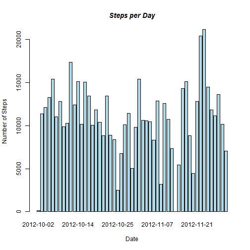
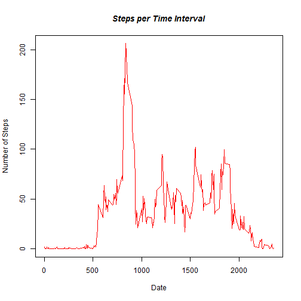
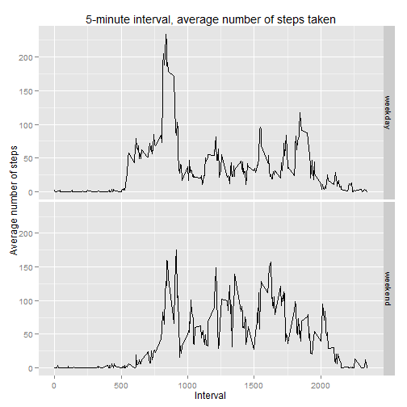

This assignment makes use of data from a personal activity monitoring device. This device collects data at 5 minute intervals through out the day. The data consists of two months of data from an anonymous individual collected during the months of October and November, 2012 and include the number of steps taken in 5 minute intervals each day.

## Loading and preprocessing the data
Load the data from the CSV file

```r
rawData <- read.csv("activity.csv")
data <- na.omit(rawData)
```

## What is mean total number of steps taken per day?

1. Show a bar plot of the number of steps per day

```r
stepsPerDay <- aggregate(steps ~ date, data = data, FUN = sum)
with(stepsPerDay,barplot(steps, names.arg = date, xlab = "Date", 
                         col = "lightblue", ylab = "Number of Steps"))
title(main = "Steps per Day", font.main = 4)
```

 

2. Calculate the mean number of steps per day

```r
totalMeanSteps <- as.integer(mean(stepsPerDay$steps))
totalMedianSteps <- as.integer(median(stepsPerDay$steps))
```

**The mean average number of steps per day is 10766 and 
the medium average is 10765** 

## What is the average daily activity pattern?

Agregate the data to sum the number of steps per time interval

```r
stepsPerInterval <- aggregate(steps ~ interval, data=data, FUN=mean)
```

1. Show a time series plot of the number of steps per time interval across all days

```r
plot(stepsPerInterval, type="l", xlab = "Date", 
                         col = "red", ylab = "Number of Steps")
title(main = "Steps per Time Interval", font.main = 4)
```

 

2.Let's find out which 5-minute interval, on average across all the days in the dataset, contains the maximum number of steps? 


```r
stepsPerInterval$steps <- as.integer(stepsPerInterval$steps)
maxStepData <- stepsPerInterval[which.max(stepsPerInterval$steps), ]
```

**The maximum number of steps was at time interval 835, 
with a total of 206 steps**

## Imputing missing values

1.Calculate and report the total number of missing values in the dataset 

```r
missingValues <- sum(is.na(rawData[,]))
```

**The sum of missing values in the dataset is 
2304**

2.My strategy for filling in all of the missing values in the dataset is to use the mean for each interval.

3. I am creating a new dataset that is equal to the original dataset but with the missing data filled in with the mean for the interval.


```r
newData <- merge(rawData, stepsPerInterval, by="interval", suffixes=c("",".y"))
naSteps <- is.na(newData$steps)
newData$steps[naSteps] <- newData$steps.y[naSteps]
newData <- newData[ ,1:3]
```


```r
head(newData)
```

```
##   interval steps       date
## 1        0     1 2012-10-01
## 2        0     0 2012-11-23
## 3        0     0 2012-10-28
## 4        0     0 2012-11-06
## 5        0     0 2012-11-24
## 6        0     0 2012-11-15
```

4. Here is a histogram of the total number of steps taken each day and a report of the mean and median total number of steps taken per day. 


```r
AdjustedStepsPerDay <- aggregate(steps ~ date, data = newData, FUN = sum)
with(AdjustedStepsPerDay,barplot(steps, names.arg = date, xlab = "Date", 
                         col = "lightgreen", ylab = "Number of Steps"))
title(main = "Steps per Day", font.main = 4)
```

 

. Now let's calculate the mean and median number of steps per day 

```r
totalStepsPerDayAfterImputing <- with(newData, aggregate(steps, list(Date = date), sum)$x)

meanAndMedian <- c(mean(totalStepsPerDayAfterImputing), median(totalStepsPerDayAfterImputing), mean(totalStepsPerDayAfterImputing), median(totalStepsPerDayAfterImputing))

meanAndMedianMatrix <- matrix(meanAndMedian,ncol=2,byrow=TRUE)

colnames(meanAndMedianMatrix) <- c("Mean","Median")
rownames(meanAndMedianMatrix) <- c("Before imputing","After  imputing")
```

.Now let's compare the mean and median before and after imputing

```r
as.table(meanAndMedianMatrix)
```

```
##                  Mean Median
## Before imputing 10750  10641
## After  imputing 10750  10641
```


## Are there differences in activity patterns between weekdays and weekends?
1. Let's create a new factor variable in the dataset with two levels - "weekday" and "weekend" indicating whether a given date is a weekday or weekend day.

```r
GetWeekends <- function(date) {
    if(weekdays(as.Date(date)) %in% c("Saturday", "Sunday")){
        day <- "weekend"
    }
    else {
        day <- "weekday"
    }
}
data$IsWeekend <- as.factor(sapply(data$date, GetWeekends))
```

2.Now let's make a panel plot containing a time series plot of the 5-minute interval (x-axis) and the average number of steps taken, averaged across all weekday days or weekend days (y-axis). 


```r
averageStepsPerDay <- with(data,aggregate(steps, list(Interval=as.numeric(as.character(interval)), Weekday= IsWeekend), mean))

ggplot(averageStepsPerDay, aes(x=Interval, y=x)) + geom_line() +
    facet_grid(Weekday ~ .) +
    labs(title="5-minute interval, average number of steps taken", 
         x="Interval", y="Average number of steps")
```

 


### Thank you for reviewing this and please give me feedback  
### -John
